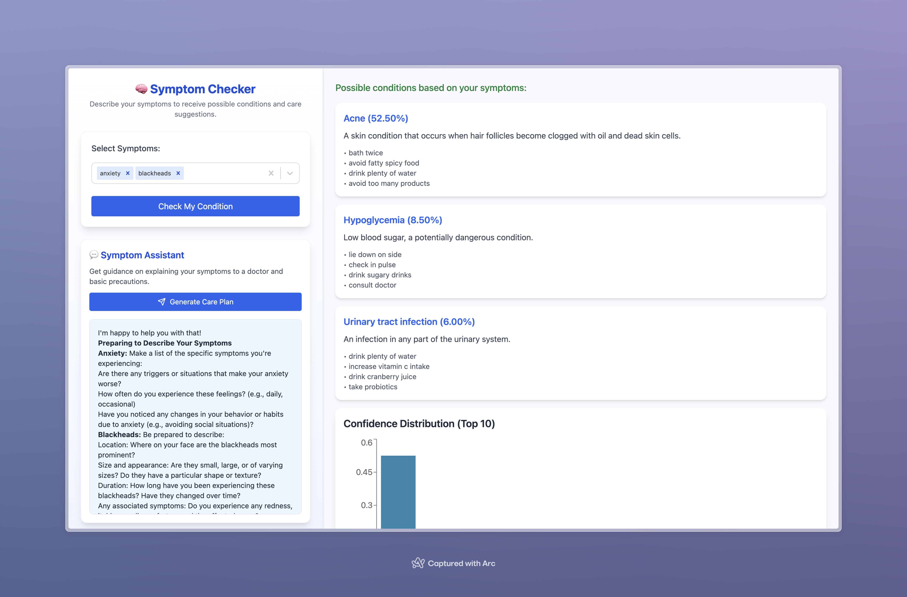

# 🧠 AI-Powered Symptom Checker

An interactive, AI-enhanced health tool that allows users to input symptoms and receive potential condition predictions, care advice, and real-time guidance through an integrated chatbot powered by Ollama.



---

## 🚀 Features

- 🔍 **Multi-select Symptom Input** – Searchable, pill-style selection using `react-select`.
- 🧠 **AI Predictions** – Uses a trained model (via backend) to return top 3 likely conditions with confidence scores.
- 📊 **Confidence Chart** – Visualize prediction probabilities with a horizontal bar chart.
- 💬 **Sidebar Chat Assistant** – Ollama-powered bot that helps users phrase symptoms for doctors and gives self-care advice.
- 💡 **Responsive & Modular UI** – Tailwind CSS + React + Framer Motion for a smooth, modern experience.

---

## 🧱 Tech Stack

**Frontend**
- React + TypeScript
- Tailwind CSS
- React Select
- Axios
- React Markdown
- Framer Motion (optional)

**Backend**
- FastAPI or Flask (Python)
- `joblib`-loaded trained model
- Ollama (for local LLMs like LLaMA 3)

---

## 📁 Folder Structure

```
symptom-checker/
├── public/
├── src/
│   ├── components/
│   │   ├── SymptomInput.tsx
│   │   ├── PredictionCard.tsx
│   │   ├── ConfidenceChart.tsx
│   │   └── SidebarAssistant.tsx
│   ├── utils/
│   │   └── api.ts
│   ├── App.tsx
│   └── index.tsx
├── backend/
│   └── app.py / main.py (FastAPI or Flask API)
├── README.md
├── package.json
└── tailwind.config.js
```

---

## 🛠️ Setup Instructions

### 1. Clone the repository

```bash
git clone https://github.com/synamalhan/symptom-checker.git
cd symptom-checker
```

### 2. Install frontend dependencies

```bash
npm install
npm run dev
```

### 3. Set up the backend (FastAPI)

```bash
cd backend
pip install -r requirements.txt
uvicorn app:app --reload  
```

> Make sure `model.pkl`, `symptom_list.pkl`, and the CSV files are in the backend folder.

### 4. Run Ollama locally

```bash
ollama run llama3
```

Ensure Ollama is available at `http://localhost:11434`.

---

## 📦 API Endpoints

* `GET /symptoms` – returns all symptom strings
* `POST /predict` – accepts `{ symptoms: string[] }`, returns predictions and probabilities
* `POST /generate` – Ollama local LLM endpoint (used by chatbot)

---

## ✨ Future Improvements

* Voice-to-text for symptom entry 🎙️
* Emotion detection & tone-aware responses 😥
* User history and saved reports 💾
* PDF export of care plans 📄
* Mobile-first enhancements 📱

---

## 📸 Demo

> Coming soon – [watch the demo here](#)

---

## 📄 License

MIT © 2025 

---